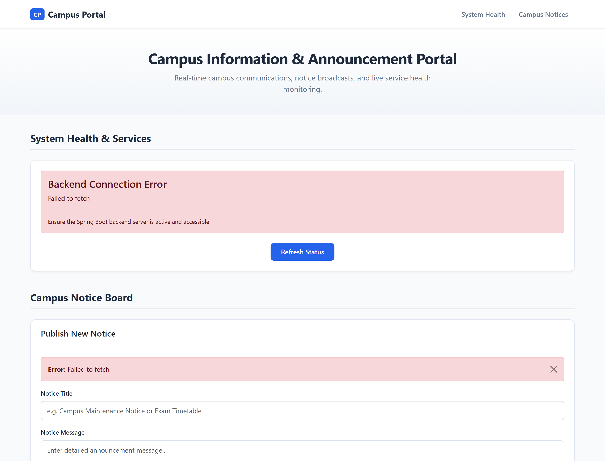
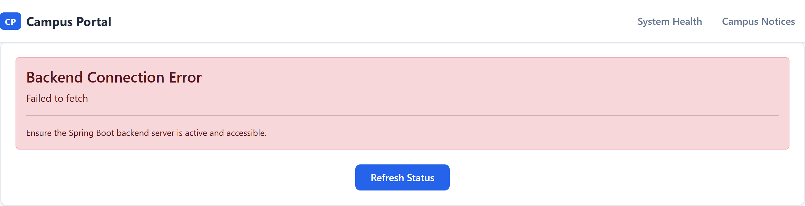
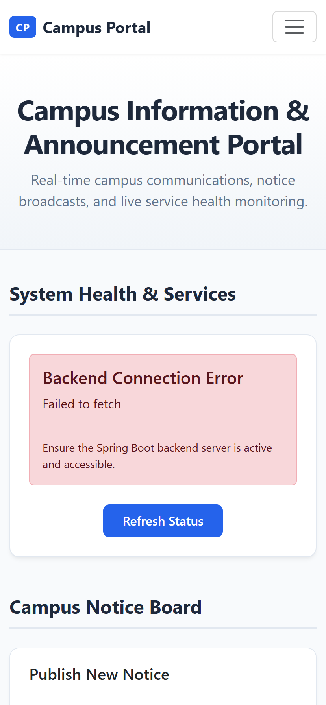
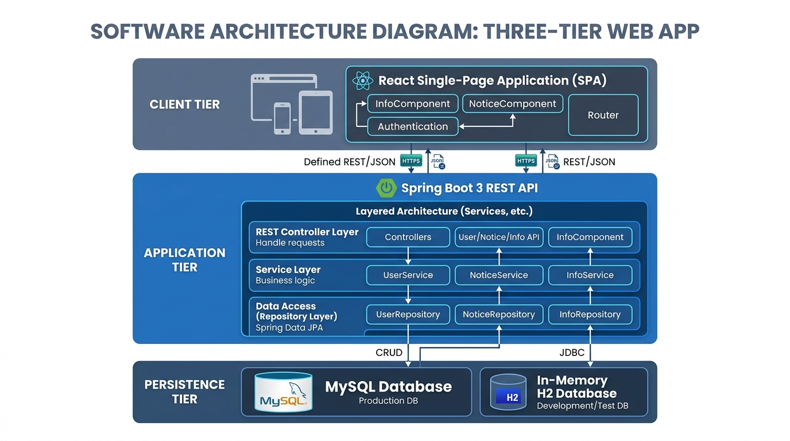
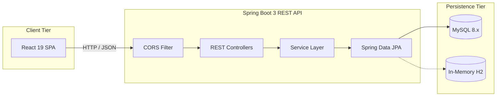

# Campus Portal

> A modern, full-stack campus communication and service health monitoring platform built with **Spring Boot 3**, **React 19**, and **MySQL**.

[](https://spring.io/projects/spring-boot)
[](https://react.dev/)
[](https://openjdk.org/)
[](https://getbootstrap.com/)
[](LICENSE)

---

## 2. Visuals & Preview

### Application Dashboard Overview


<div align="center">
  <table width="100%">
    <tr>
      <td width="50%" align="center">
        <strong>Service Health Monitor</strong><br/>
        
      </td>
      <td width="50%" align="center">
        <strong>Mobile Responsive Layout</strong><br/>
        
      </td>
    </tr>
  </table>
</div>

### Three-Tier System Architecture


---

## 3. Overview & Motivation

Educational institutions require reliable, centralized channels to broadcast critical academic schedules, administrative updates, and event notices while continuously monitoring the availability of connected campus services.

**Campus Portal** provides a responsive, single-pane-of-glass interface where:
- **Campus Administrators** can publish, browse, and manage campus-wide announcements with real-time feedback.
- **Students & Faculty** can instantly view announcements organized chronologically.
- **Operations & IT Staff** can monitor the operational health of background domain microservices with one-click diagnostic updates.

This project was built to demonstrate enterprise Java full-stack patterns, clean decoupled architecture, and production-ready code quality standards.

---

## 4. Features

### Frontend (React 19 SPA)
- **Interactive Notice Publishing**: Clean form with instant validation, character bounds, and responsive success/error alerts.
- **Dynamic Notice Feed**: Real-time card feed displaying announcements formatted by timestamp.
- **Notice Management**: One-click notice deletion with confirmation prompts and state synchronization.
- **Live Service Health Monitor**: Visual status indicators (active/inactive) for campus backend microservices (`StudentService`, `CourseService`, `LoggerService`).
- **Responsive Layout**: Mobile-first grid with custom color variables and smooth micro-interactions.

### Backend (Spring Boot 3 REST API)
- **RESTful Endpoints**: Full CRUD endpoints for notices, health checks, and database profile introspection.
- **Layered Architecture**: Strict separation across Controllers, Services, Repositories, and JPA Entities.
- **Validation**: Jakarta Bean Validation enforcing non-blank constraints and field lengths on API requests.
- **Spring DI Mastery**: Idiomatic Constructor Injection with polymorphic bean selection (`@Primary` and `@Qualifier`).
- **Multi-Profile Persistence**: Environment-driven profile switching for MySQL (`dev`), PostgreSQL (`prod`), and in-memory H2 (`test`).
- **Security & CORS**: Global CORS configuration segregating client origins and parameterized environment credentials.

---

## 5. Tech Stack

| Layer | Technologies | Purpose |
| :--- | :--- | :--- |
| **Frontend** | React 19, React-Bootstrap, HTML5/CSS3 | Component-driven presentation & state management |
| **Backend** | Java 17 LTS, Spring Boot 3.5.7 | REST API, validation, dependency injection & business logic |
| **Persistence** | Spring Data JPA, Hibernate 6, MySQL 8.x | Object-relational mapping & relational data storage |
| **Testing** | JUnit 5, MockMvc, H2 Database | Integration testing with zero external dependencies |
| **Build & Tooling** | Maven Wrapper (`mvnw`), npm | Dependency management, bundling & continuous integration |

---

## 6. Architecture & Documentation Directory



### Complete Documentation Suite
- 📖 [Setup & Installation Guide](docs/setup.md) — Step-by-step local workstation setup & troubleshooting.
- 📐 [System Architecture Documentation](docs/architecture.md) — Tier architecture, Spring DI design, and schemas.
- 🔌 [REST API Specification](docs/api.md) — Full endpoint reference with JSON payloads and error codes.
- 🛠️ [Developer & Contribution Guide](docs/development.md) — Code style, testing guidelines, and commit standards.
- 📑 [Architecture Decision Records (ADRs)](docs/decisions.md) — Technical rationale and trade-off records.

---

## 7. Installation & Quickstart

### Prerequisites
- **Java**: JDK 17 or higher
- **Node.js**: Node 18+ and npm 9+
- **Database**: MySQL 8.x (optional; test profile runs in-memory via H2)

```bash
# 1. Clone the repository
git clone https://github.com/sedmugen/campus-portal.git
cd campus-portal

# 2. Configure environment variables
cp .env.example .env

# 3. Start Backend (in server/)
cd server
./mvnw spring-boot:run

# 4. Start Frontend (in client/)
cd ../client
npm install
npm start
```
*Backend runs on `http://localhost:8080` and frontend runs on `http://localhost:3000`.*  
*For in-depth troubleshooting, see the [Setup Guide](docs/setup.md).*

---

## 8. Usage Guide

1. **View Campus Notices**: Navigate to `http://localhost:3000/#notices` to see active announcements.
2. **Publish an Announcement**: Fill in the title and description under **Publish New Notice** and click **Publish Notice**.
3. **Delete a Notice**: Click the red trash icon on any notice card and confirm deletion.
4. **Inspect Service Status**: View the **System Health & Services** cards and click **Refresh Status** to query live backend states.

---

## 9. Roadmap

- [ ] **Role-Based Authentication**: Spring Security 6 with JWT authentication for Administrator, Faculty, and Student roles.
- [ ] **Notice Categories & Search**: Category tags (Urgent, Academic, Events, Facility) with full-text search filtering.
- [ ] **Email & Push Notifications**: Webhook integration for instant notifications when high-priority notices are posted.
- [ ] **Docker Compose Deployment**: Single-command containerized deployment orchestrating client, server, and MySQL database containers.

---

## 10. License & Attribution

Distributed under the **MIT License**. See [`LICENSE`](LICENSE) for details.

Developed and maintained by **Saad** ([@sedmugen](https://github.com/sedmugen)).
