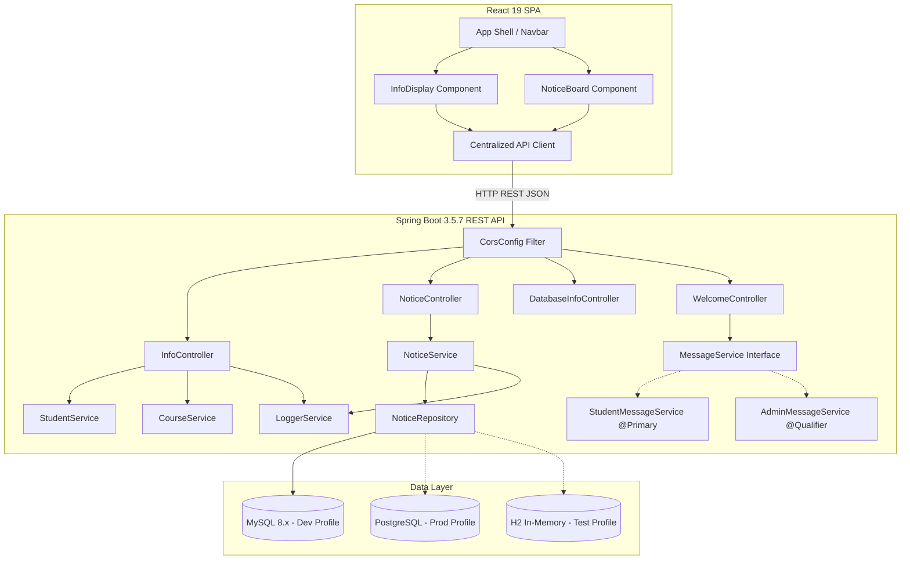

# System Architecture: Campus Portal

This document outlines the architectural blueprint, component design, data flow, and infrastructure patterns implemented in **Campus Portal**.

---

## 1. High-Level System Architecture

Campus Portal is architected as a decoupled, full-stack web application with a clear separation of concerns across presentation, business logic, and persistence layers.



---

## 2. Layered Backend Design

The backend conforms strictly to enterprise Spring Boot layered architecture:

1. **Controller Layer (`com.saad.campusportal.controller`)**:
   - Handles incoming HTTP requests, validates request payloads via `@Valid`, and delegates business operations to appropriate services.
   - Standardizes HTTP status codes (`200 OK`, `201 Created`, `400 Bad Request`, `404 Not Found`).

2. **Service Layer (`com.saad.campusportal.service`)**:
   - Encapsulates domain logic, cross-cutting audit logging via `LoggerService`, and transactional boundaries.

3. **Repository Layer (`com.saad.campusportal.repository`)**:
   - Inherits from `JpaRepository<Notice, Long>` to provide CRUD capabilities, pagination, and derived query methods like `findAllByOrderByCreatedAtDesc()`.

4. **Entity Model (`com.saad.campusportal.model`)**:
   - JPA entity `Notice` mapped with Hibernate and Jakarta validation constraints. Uses `@PrePersist` to automatically populate timestamps.

---

## 3. Dependency Injection Mechanics

The application showcases idiomatic Spring Framework Dependency Injection (DI) strategies:

### 3.1 Constructor Injection (Production Standard)
Used throughout `NoticeController`, `InfoController`, `NoticeService`, `StudentService`, and `CourseService`.
- **Benefits**: Immutable dependencies (`final`), promotes testability with standard mock objects, prevents `NullPointerException` during runtime initialization.

```java
@RestController
@RequestMapping("/api/notice")
public class NoticeController {
    private final NoticeService noticeService;

    public NoticeController(NoticeService noticeService) {
        this.noticeService = noticeService;
    }
}
```

### 3.2 Polymorphic Bean Selection (`@Primary` vs `@Qualifier`)
- The `MessageService` interface is implemented by both `StudentMessageService` and `AdminMessageService`.
- `StudentMessageService` is annotated with `@Primary` to act as the default autowired bean.
- `AdminMessageService` is selected explicitly when required using `@Qualifier("adminMessageService")`.

---

## 4. Multi-Profile Environment Configuration

The application implements dynamic environment-based configuration using the `DatabaseConfig` interface and Spring `@Profile`:

| Profile | Configuration Class | Intended Target | Connection Parameters |
| :--- | :--- | :--- | :--- |
| **`dev`** (Default) | `MySQLDatabaseConfig` | Local Developer Workstations | Port 3306, MySQL 8.x, `ddl-auto=update` |
| **`prod`** | `PostgreDatabaseConfig` | Cloud Production Deployments | Port 5432, PostgreSQL, SSL enabled |
| **`test`** | In-Memory Application Config | CI/CD Pipeline & Unit Tests | In-memory H2 database, `create-drop` |

---

## 5. Data Model & Entity Schema

### `Notice` Entity

| Column | Data Type | Constraints | Description |
| :--- | :--- | :--- | :--- |
| `id` | `BIGINT` | `PRIMARY KEY`, `AUTO_INCREMENT` | Unique identifier for notice |
| `title` | `VARCHAR(150)` | `NOT NULL`, max length 150 | Headline of the announcement |
| `message` | `VARCHAR(2000)` | `NOT NULL`, max length 2000 | Body message of the notice |
| `created_at` | `DATETIME` | `NOT NULL` | Timestamp set automatically on persist |
